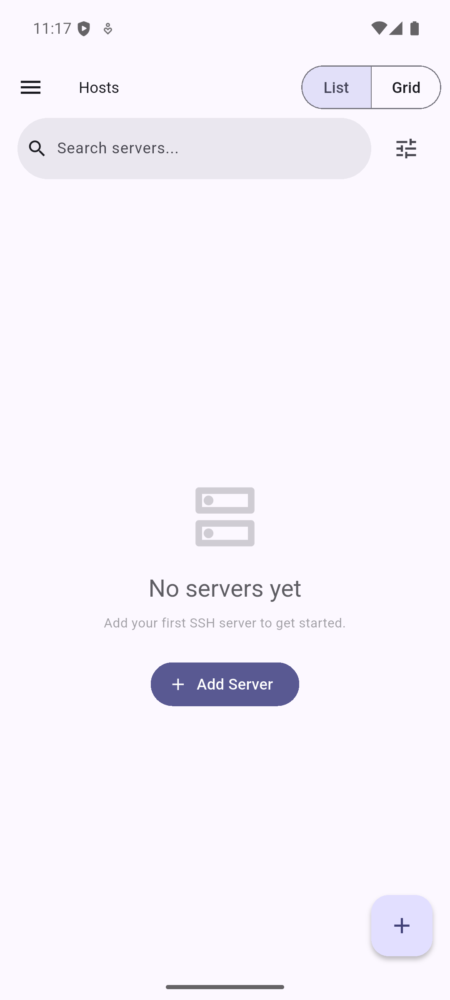
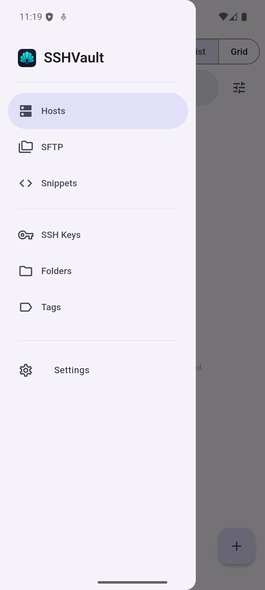
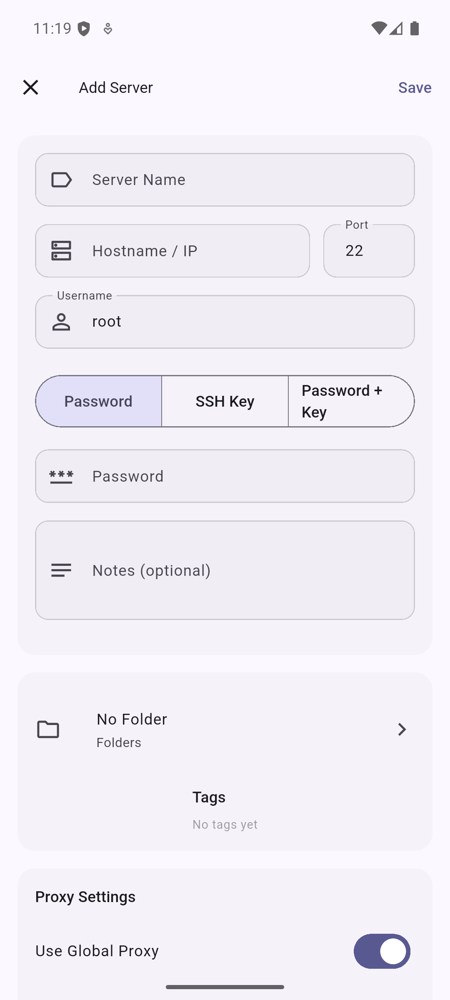
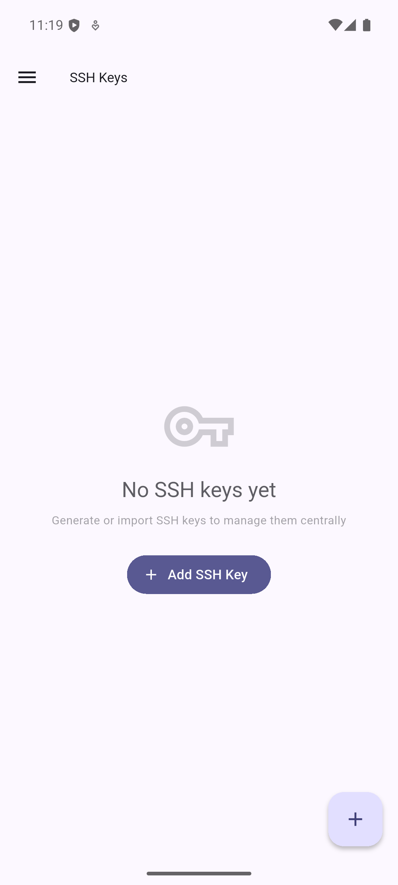
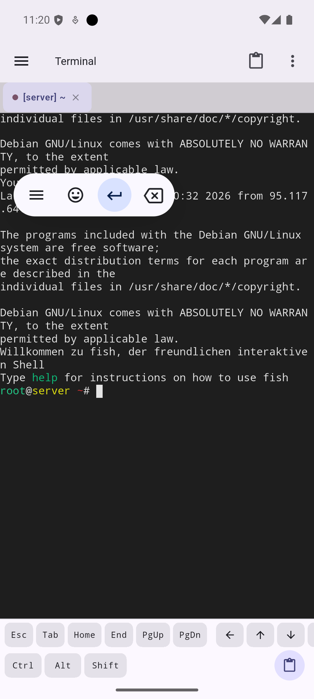
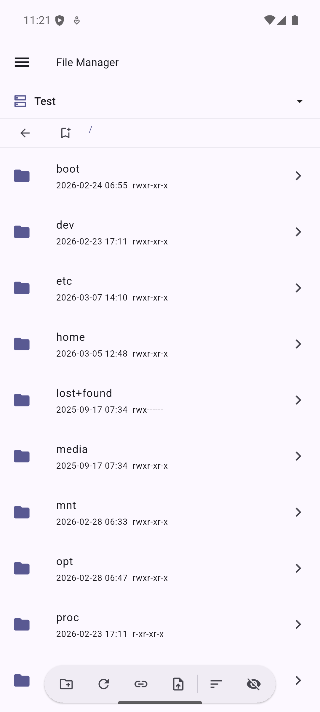
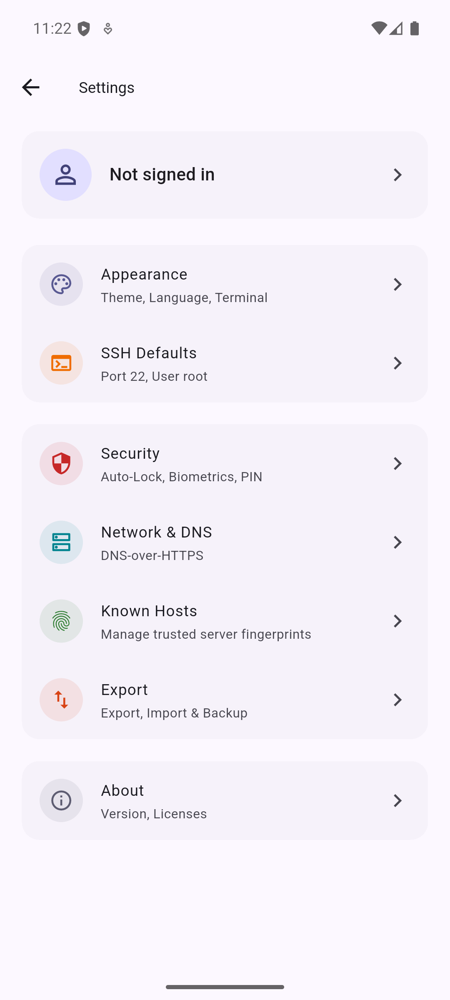

<p align="center">
  
</p>

<h1 align="center">SSHVault</h1>

<p align="center">
  <strong>Zero-Knowledge Encrypted SSH Client</strong><br>
  Secure, self-hosted, cross-platform terminal and SFTP manager
</p>

<p align="center">
  <a href="https://github.com/Kiefer-Networks/sshvault/releases"></a>
  <a href="LICENSE"></a>
  <a href="https://github.com/Kiefer-Networks/sshvault/actions/workflows/ci.yml"></a>
  <a href="https://github.com/Kiefer-Networks/sshvault/issues"></a>
  <a href="https://github.com/Kiefer-Networks/sshvault/stargazers"></a>
</p>

<p align="center">
  <a href="https://play.google.com/store/apps/details?id=de.kiefer_networks.sshvault"></a>
  <a href="https://fdroid.kiefer-networks.de/fdroid/repo/"></a>
  <a href="https://kiefer-networks.de"></a>
  <a href="https://de.liberapay.com/beli3ver"></a>
</p>

---

SSHVault is a cross-platform SSH terminal and SFTP file manager that encrypts all data client-side before syncing. The server never sees your plaintext credentials, keys, or session data.

## Screenshots

<p align="center">
  
  
  
  
</p>
<p align="center">
  
  
  
</p>

## Features

| Feature | Description |
|---------|-------------|
| **SSH Terminal** | Split view, tabs, multiple simultaneous sessions, xterm-256color emulation |
| **SFTP File Manager** | Browse, transfer, rename, chmod, symlinks, archive extraction, bookmarks |
| **Zero-Knowledge Encryption** | AES-256-GCM with Argon2id key derivation |
| **Host Key Verification** | Trust On First Use (TOFU) with known hosts management |
| **SSH Key Management** | Ed25519, RSA, ECDSA key generation and import |
| **SSH Config Import** | Import hosts and keys from `~/.ssh/config` on desktop |
| **Jump Hosts** | ProxyJump support for multi-hop connections |
| **Proxy Support** | SOCKS5 and HTTP CONNECT, global or per-server configuration |
| **Code Snippets** | Save and organize frequently used commands |
| **Server Organization** | Folders, tags, color codes, icons, search and filtering |
| **Post-Connect Commands** | Auto-run commands after connection |
| **Biometric Lock** | Fingerprint/Face ID with PIN fallback and duress PIN |
| **Cross-Device Sync** | End-to-end encrypted via self-hosted backend |
| **Keep-Alive & Timeouts** | Configurable keep-alive interval and connection timeout |
| **SSH Compression** | Optional compression toggle for slow connections |
| **Export & Import** | Full backup and restore of all data |
| **No Tracking** | No analytics, no telemetry, no ads, no in-app purchases |

## Platforms

| Platform | Status |
|----------|--------|
| Android | Supported |
| iOS / iPadOS | Supported |
| macOS | Supported |
| Linux | Supported (Flatpak) |
| Windows | Supported |

## Install via F-Droid Repo

Add the Kiefer Networks F-Droid repository to your F-Droid client:

```
https://fdroid.kiefer-networks.de/fdroid/repo/
```

## Install via Obtainium

You can install SSHVault directly from GitHub releases using [Obtainium](https://github.com/ImranR98/Obtainium):

1. Open Obtainium and tap **Add App**
2. Enter the source URL:
   ```
   https://github.com/Kiefer-Networks/sshvault
   ```
3. Set **Release asset filter** to `arm64-v8a` (or your architecture)
4. Tap **Add** — Obtainium will track new releases and notify you of updates

## Security

| Layer | Implementation |
|-------|---------------|
| Encryption | AES-256-GCM, 12-byte counter nonces |
| Key Derivation | Argon2id (256 MiB, 3 iterations, p=1) |
| SSH Transport | CSPRNG padding, SHA-256 fingerprints, constant-time MAC |
| Server Attestation | Ed25519 TOFU key pinning (official + self-hosted) |
| DNS | DNS-over-HTTPS with multi-provider cross-verification |
| Storage | Platform keychain (Keystore / Keychain / libsecret / DPAPI) |
| PIN | Argon2id hashed, brute-force lockout, duress wipe |
| Server | Response padding, timing equalization, PoW challenges |

Weak algorithms (DH-group1, CBC ciphers, HMAC-MD5/SHA1, ssh-rsa) are excluded from default negotiation.

### ssh-agent integration (Linux + macOS)

SSHVault talks directly to the OpenSSH agent over the unix-domain socket
referenced by `$SSH_AUTH_SOCK`, using a pure-Dart implementation of the
agent wire protocol (no native bindings, no shelling out to `ssh-add`).
This unlocks two flows:

- **Read from the running agent** — when adding a host, SSHVault offers
  every key currently held by the agent so you can pick one without
  copying private material into the vault.
- **Write SSHVault keys to the running agent** — each key in the vault
  has *Add to ssh-agent* / *Remove from agent* buttons, so other Linux
  apps (git, scp, ansible, vscode-remote-ssh) can use SSHVault-managed
  keys without ever touching the underlying private file. Lifetime is
  configurable in *Settings → Security → ssh-agent integration* (default
  1 h, `0` = no expiry).

Agent-loaded keys are surfaced with an `agent` chip on the key list so
you can tell at a glance which material is live in the running session.

The integration is environment-aware: on platforms or sessions where
`$SSH_AUTH_SOCK` is unset (Windows, headless CI, mobile) the feature
gracefully degrades — the buttons remain hidden, the host-form
"Use key from ssh-agent" option is suppressed, and SSHVault falls back
to its own key vault as if the agent integration weren't there.

### Supported SSH algorithms

The bundled hardened `dartssh2` fork advertises only modern algorithms.
Connections to servers that require something not on this list will fail
during the SSH transport handshake (the connect dialog reports which
class — KEX, cipher, MAC, host key — was rejected).

| Layer | Supported (in negotiation order) |
|-------|----------------------------------|
| Key exchange | `mlkem768x25519-sha256`, `sntrup761x25519-sha512@openssh.com`, `curve25519-sha256@libssh.org`, `ecdh-sha2-nistp521`, `ecdh-sha2-nistp384`, `ecdh-sha2-nistp256`, `diffie-hellman-group-exchange-sha256`, `diffie-hellman-group14-sha256` |
| Host key | `ssh-ed25519`, `rsa-sha2-512`, `rsa-sha2-256`, `ecdsa-sha2-nistp521`, `ecdsa-sha2-nistp384`, `ecdsa-sha2-nistp256` |
| Cipher | `chacha20-poly1305@openssh.com`, `aes256-gcm@openssh.com`, `aes128-gcm@openssh.com`, `aes256-ctr`, `aes128-ctr` |
| MAC | `hmac-sha2-256-etm@openssh.com`, `hmac-sha2-512-etm@openssh.com`, `hmac-sha2-256`, `hmac-sha2-512`, `hmac-sha2-256-96`, `hmac-sha2-512-96` (ignored when an AEAD cipher is selected) |

The two hybrid post-quantum KEX algorithms (`mlkem768x25519-sha256`, `sntrup761x25519-sha512@openssh.com`) match the OpenSSH 9.9+ default order and are advertised first. The KEMs come from the [Open Quantum Safe](https://github.com/open-quantum-safe/liboqs) `liboqs` library bundled per platform via Dart FFI; on builds where `liboqs` is not present (e.g. Flutter web) the names are stripped from the advertised list at runtime and the client falls back to classical KEX without any error.

### PuTTY .ppk import

SSHVault imports PuTTY private keys (`.ppk`) directly — no `puttygen`
conversion required.

- **Detected formats:** PPK v2 (`PuTTY-User-Key-File-2:`) and PPK v3
  (`PuTTY-User-Key-File-3:`).
- **Encryption:** unencrypted keys load instantly; encrypted keys are
  decrypted with AES-256-CBC after the KDF derives the AES key —
  PPK v2 uses PuTTY's SHA-1 KDF and PPK v3 uses Argon2id with the
  parameters embedded in the file. Both MAC variants (HMAC-SHA1 for v2,
  HMAC-SHA-256 for v3) are verified before the key is accepted; a wrong
  passphrase or tampered file is rejected with a `PpkParseException`.
- **Supported algorithms:** RSA, Ed25519, and ECDSA P-256 / P-384 / P-521.
- **How it lands in the vault:** the parser re-serializes the key into
  the standard OpenSSH private-key format (`-----BEGIN OPENSSH PRIVATE
  KEY-----`) so downstream code (`dartssh2`, `ssh-agent` forwarding,
  exports) treats it identically to a key generated inside SSHVault.
- **Importing:** open *Add SSH key → Import*, paste the `.ppk` text or
  use *Import from file*; for encrypted keys provide the passphrase.
  On Windows, double-clicking a `.ppk` opens SSHVault directly because
  the installer registers the file association under
  `HKCU\Software\Classes\.ppk`.

## Architecture

- **Client:** Flutter 3.11+ / Dart 3.11+
- **Backend:** [sshvault-server](https://github.com/Kiefer-Networks/sshvault-api) — Go 1.26+, PostgreSQL 16+, chi router
- **State Management:** Riverpod (no setState)
- **Local Database:** Drift (SQLite) + Platform Secure Storage
- **Routing:** go_router (declarative)
- **SSH:** dartssh2 (hardened fork)
- **Design:** Material 3 on all platforms

Clean Architecture with feature-based folder structure. Structured logging only.

## Building from Source

### Prerequisites

- Flutter SDK 3.11+ ([install guide](https://docs.flutter.dev/get-started/install))
- Android SDK with `minSdk 33` (Android 13+)
- Java 17+ (for Android builds)
- For Linux: `sudo dnf install libsecret-devel` (Fedora) or `sudo apt install libsecret-1-dev` (Debian/Ubuntu)

### Clone

```bash
git clone https://github.com/Kiefer-Networks/sshvault.git
cd sshvault
```

### Install dependencies and generate code

```bash
flutter pub get
dart run build_runner build --delete-conflicting-outputs
flutter gen-l10n
```

### Build Android APK

```bash
# Per-ABI builds (~30 MB each, recommended)
flutter build apk --release --split-per-abi

# Universal build (~80 MB, all architectures)
flutter build apk --release
```

Per-ABI APKs will be at `build/app/outputs/flutter-apk/app-{arm64-v8a,armeabi-v7a,x86_64}-release.apk`.

### Build Android App Bundle (AAB)

```bash
flutter build appbundle --release
```

### Other platforms

```bash
flutter build ipa --release         # iOS
flutter build linux --release       # Linux
flutter build macos --release       # macOS
flutter build windows --release     # Windows
```

### Windows Credential Manager (master vault key)

On Windows the master vault key is persisted to the **Windows Credential
Vault** (`advapi32.dll!CredWriteW`) under the target name
`de.kiefer_networks.SSHVault.MasterKey`. Each entry is encrypted with
DPAPI under the user's logon credential, follows them across machines
when roaming profiles are enabled, and is auditable from
`control.exe /name Microsoft.CredentialManager` (or
`cmdkey /list:de.kiefer_networks.SSHVault.MasterKey`).

| Detail | Value |
|--------|-------|
| Target name | `de.kiefer_networks.SSHVault.MasterKey` |
| Type | `CRED_TYPE_GENERIC` |
| Persist | `CRED_PERSIST_LOCAL_MACHINE` (survives logoff, dropped on OS reinstall) |
| Backed by | DPAPI under the user's logon credential |

Older installs that pre-date this change persisted the key through
`flutter_secure_storage`'s default Windows backend (also DPAPI, but
stored in the app's data directory rather than as a first-class
credential). On the first launch after upgrading, SSHVault transparently
copies that value into the Credential Vault and removes the legacy
entry.

#### Windows Hello pre-unlock

When **Settings → Security → Biometric unlock** is on, every read of
the master key is gated by
`Windows.Security.Credentials.UI.UserConsentVerifier.RequestVerificationAsync`
via the [`local_auth`](https://pub.dev/packages/local_auth) package
(supported on Windows 10 1809+). This means a user who walks away from
their machine cannot have the vault re-opened without a fresh
fingerprint / face / PIN prompt, even if the OS session is still
active. The toggle is a no-op on machines without a Windows Hello
provisioning (for example, a desktop without a compatible camera or
fingerprint reader and no PIN).

To remove the credential out-of-band — for example, when migrating a
machine — open *Credential Manager → Windows Credentials* and delete
the entry under `de.kiefer_networks.SSHVault.MasterKey`. SSHVault will
prompt for the master passphrase again on the next launch.

### Windows native toast notifications

While at least one SSH session is active, SSHVault surfaces a rolling
notification through the native
`Windows.UI.Notifications.ToastNotificationManager` API (via the
[`local_notifier`](https://pub.dev/packages/local_notifier) package). This
replaces the legacy balloon-style fallback that
`flutter_local_notifications` uses on Win32 so the toast looks and behaves
like every other Windows 11 notification:

- It renders with the SSHVault icon + display name resolved from the
  registered AppUserModelID `de.kiefer_networks.SSHVault`.
- It persists in **Action Center** after dismissal — you can re-open it,
  click an action button, or clear it like any first-party Windows toast.
- Two action buttons are attached when the toggle is on:
  **Disconnect** closes the most recently surfaced session and
  **Show** brings the SSHVault window to the foreground and routes to
  the terminal branch.
- Successive updates use *replace-by-id* semantics, so connecting to a
  new host updates the existing entry rather than stacking duplicates.

The AUMID is registered in two places that **must stay in sync**:

1. The Inno Setup installer writes the descriptor under
   `HKCU\Software\Classes\AppUserModelId\de.kiefer_networks.SSHVault`
   (DisplayName, IconUri, IconBackgroundColor).
2. `lib/main.dart` calls `windowManager.setAppUserModelId(...)` early
   during boot so toasts produced by a portable / zip-installed copy
   still resolve correctly.

To silence Windows toasts entirely, open
**Settings → Appearance → Notifications** and turn off
**Show action buttons** (default on). The toggle is Windows-only — Linux
and macOS continue to use `flutter_local_notifications` and are not
affected.

### Linux clipboard persistence on Wayland

Under a Wayland compositor the clipboard offer is owned by the process that
put the data there: as soon as the owning process exits, the offer is gone.
That breaks the very common pattern "open SSHVault → copy a private key /
password → close SSHVault → paste into a terminal".

To work around this, SSHVault detects Wayland sessions
(`WAYLAND_DISPLAY` set on Linux) and shells out to `wl-copy`
(from the `wl-clipboard` package) as a detached helper. The helper keeps the
clipboard offer alive after the SSHVault window is closed, until either the
user pastes or the 30 s auto-clear timer fires (which then runs
`wl-copy --clear`). On X11, macOS, Windows, and mobile, the standard
in-process clipboard is used because those platforms don't have this
limitation.

`wl-clipboard` ships in the default install of every mainstream Wayland
distro (Fedora, Ubuntu, Debian, Arch, openSUSE) and is bundled in the
SSHVault Flatpak runtime, so no manual setup is needed in the typical case.
On a minimal/headless Wayland install you can opt in via your distro's
package manager:

```bash
sudo dnf install wl-clipboard          # Fedora
sudo apt install wl-clipboard          # Debian / Ubuntu
sudo pacman -S wl-clipboard            # Arch
sudo zypper install wl-clipboard       # openSUSE
```

If `wl-copy` is missing the app falls back to the in-process clipboard
silently — copy still works, it just doesn't survive the app exiting.

### Linux DBus integration

SSHVault on Linux owns the well-known session-bus name
`de.kiefer_networks.SSHVault` and exports
`/de/kiefer_networks/SSHVault` implementing the
`de.kiefer_networks.SSHVault` interface. This gives you:

- Single-instance enforcement: a second `sshvault` invocation forwards its
  argv (e.g. `ssh://host`) to the running instance and exits.
- External triggers from KRunner, Rofi, Polybar etc.:
  - `Connect(s host_id)` — open a session for a stored host id.
  - `Disconnect(s session_id)` — close an active session.
  - `ListHosts() -> a(ssss)` / `ListSessions() -> a(ssss)`.
  - `OpenUrl(s url)` — handles `ssh://...` URLs.
  - `Activate()` — raise the window.
- Subscribable signals: `SessionStarted(host_id, session_id)`,
  `SessionEnded(session_id)`, `Notified(message)`.

Distros packaging SSHVault should install
`linux/de.kiefer_networks.SSHVault.service` to
`/usr/share/dbus-1/services/` so that DBus can autostart the binary on first
method call:

```ini
[D-BUS Service]
Name=de.kiefer_networks.SSHVault
Exec=/usr/bin/sshvault
```

For Flatpak, the manifest needs `--talk-name=de.kiefer_networks.SSHVault` —
this is the app's own well-known name, so it is normally granted by default.

### Global keyboard shortcut (Quick connect)

SSHVault registers a system-wide hotkey (`Super+Shift+S` by default) that
opens the **Quick connect** overlay from anywhere on the desktop. The
binding goes through `org.freedesktop.portal.Desktop →
GlobalShortcuts`, which is supported on:

- GNOME 45+ (xdg-desktop-portal-gnome 1.16+)
- KDE Plasma 5.27+ / 6.x (xdg-desktop-portal-kde)

The first time the app starts you'll see a portal dialog asking you to
confirm or rebind the trigger. You can change it later from
**Settings → Network → Desktop integration → Global shortcut → Re-bind**.

On XFCE, LXQt and other desktops without a `GlobalShortcuts` portal
backend, bind a hotkey in your desktop settings (XFCE: *Settings →
Keyboard → Application Shortcuts*) to this exact `dbus-send` line:

```sh
dbus-send --session --type=method_call \
  --dest=de.kiefer_networks.SSHVault \
  /de/kiefer_networks/SSHVault \
  de.kiefer_networks.SSHVault.Activate
```

The Flatpak manifest already grants
`--talk-name=org.freedesktop.portal.Desktop`, so no extra permission is
required.

### XDG desktop portals (Flatpak)

SSHVault is sandbox-clean: every host interaction that could leak
filesystem access or punch out of the bubblewrap goes through an XDG
desktop portal. The Flatpak manifest only needs a single
`--talk-name=org.freedesktop.portal.Desktop` — that one bus name covers
the whole portal surface.

| Portal | Used by | Replaces |
|--------|---------|----------|
| `org.freedesktop.portal.FileChooser` | `file_picker` 10.x — SFTP upload/download, SSH key import, settings export, vault import/export, `~/.ssh/config` import | direct `GtkFileChooserNative` |
| `org.freedesktop.portal.OpenURI` | `url_launcher` 6.3.x — About screen links, error-message links | `Process.start('xdg-open', …)` |
| `org.freedesktop.portal.Settings` | `DesktopAppearanceService` — live `prefers-color-scheme` + accent color | direct GSettings reads |
| `org.freedesktop.portal.Secret` | `KeyringService` — fallback for the vault master key when `org.freedesktop.secrets` is unreachable | direct libsecret only |

Read-only access to the host's SSH client configuration and key
material is granted via `--filesystem=xdg-config/ssh:ro` and
`--filesystem=~/.ssh:ro` — the picker portal handles ad-hoc choices,
but importing well-known files (`~/.ssh/config`, `~/.ssh/id_*`) is a
direct read. The legacy `--talk-name=org.freedesktop.secrets` is kept
for backwards-compatibility with existing installs but is no longer
strictly required: distributors may drop it for a tighter sandbox and
SSHVault will transparently use `org.freedesktop.portal.Secret`
instead.

### Linux AppArmor profile (native packages only)

When SSHVault is installed from a native package on Debian, Ubuntu or
OpenSUSE — i.e. **outside** the Flatpak sandbox — it ships with an AppArmor
profile that confines what the binary can read, write and connect to.

> **Flatpak users:** you do not need this profile. The Flatpak sandbox
> (bubblewrap + XDG portals) is already strictly tighter; running both at
> once only complicates debugging.

The profile lives at `linux/apparmor/de.kiefer_networks.sshvault` and is
copied to `/etc/apparmor.d/de.kiefer_networks.sshvault` by the package's
post-install hook (`linux/apparmor/postinst.sh`), which then runs
`apparmor_parser -r` to load it without requiring a reboot.

**What it allows:**

| Resource | Access |
|----------|--------|
| `~/.ssh/config`, `~/.ssh/known_hosts`, `~/.ssh/id_*`, `~/.ssh/id_*.pub` | read-only |
| `~/.local/share/sshvault/`, `~/.config/sshvault/` | read/write |
| `~/.config/autostart/de.kiefer_networks.sshvault.desktop` | read/write |
| Bundled `flutter_assets/`, `libapp.so`, `libflutter_linux_gtk.so`, `libliboqs.so*` | read |
| TCP/UDP network (IPv4 + IPv6) | outbound |
| ssh-agent socket (`$SSH_AUTH_SOCK`), `ssh-keysign` helper | unix peer / exec |
| DBus: own well-known name `de.kiefer_networks.SSHVault` | bind |
| DBus: `org.freedesktop.secrets` (libsecret), `org.freedesktop.portal.*`, `org.freedesktop.login1.Manager`, `org.freedesktop.Notifications`, `org.kde.StatusNotifierWatcher` | talk |

**What it explicitly denies** (even though `~` would otherwise be readable):

- `~/.gnupg/`, `~/.mozilla/`
- Browser profiles + cookies (Chrome, Chromium, Edge, Brave, Vivaldi, Firefox cache)
- Password stores (`~/.password-store`, `*.kdbx`, KeePassXC, Bitwarden, 1Password, the legacy `~/.local/share/keyrings/`)
- Shell history (`.bash_history`, `.zsh_history`, `.python_history`)
- Raw block devices (`/dev/sd*`, `/dev/nvme*`) and kernel introspection (`/proc/kcore`, `/proc/kallsyms`)

**Disable for debugging:**

```bash
# Temporary — log violations but do not enforce them
sudo aa-complain /etc/apparmor.d/de.kiefer_networks.sshvault

# Full disable (until you re-enable or reload)
sudo aa-disable /etc/apparmor.d/de.kiefer_networks.sshvault

# Re-enable
sudo aa-enforce /etc/apparmor.d/de.kiefer_networks.sshvault

# Watch live denials while reproducing the bug
sudo journalctl -kf | grep -i apparmor
```

**Add custom paths** (e.g. you keep your vault on an external disk, or you
import keys from `~/Projects/secrets/`) without editing the shipped profile
— drop a snippet into `/etc/apparmor.d/local/de.kiefer_networks.sshvault`,
which the main profile already `include`s if it exists. The file survives
package upgrades.

```bash
# /etc/apparmor.d/local/de.kiefer_networks.sshvault
owner /mnt/encrypted-disk/sshvault/** rwk,
owner @{HOME}/Projects/secrets/**     r,
```

Then reload:

```bash
sudo apparmor_parser -r /etc/apparmor.d/de.kiefer_networks.sshvault
```

**Validate** the profile before shipping a release:

```bash
./linux/apparmor/test_profile.sh
```

This runs `apparmor_parser -Q` (parse only, no kernel load) so it works in
CI containers that don't have an AppArmor-enabled kernel.

### Run tests

```bash
flutter test
```

## Backend

The self-hosted backend handles encrypted vault sync and authentication. It never processes plaintext user data.

See [sshvault-server](https://github.com/Kiefer-Networks/sshvault-api) for setup instructions.

## Localization

Available in 28 languages:

Arabic, Chinese, Czech, Danish, Dutch, English, Finnish, French, German, Greek, Hebrew, Hindi, Hungarian, Indonesian, Italian, Japanese, Korean, Norwegian, Polish, Portuguese, Romanian, Russian, Spanish, Swedish, Thai, Turkish, Ukrainian, Vietnamese

Translation files are in `lib/l10n/`.

## Privacy

SSHVault is built with a privacy-first philosophy:

- **Zero telemetry** - no analytics, crash reporting, or usage metrics are collected
- **Zero tracking** - no advertising identifiers, no third-party tracking domains
- **All data local** - SSH credentials, vault contents, settings, and host history live only on your device (encrypted at rest)
- **No accounts, no cloud** - SSHVault never phones home; the only network traffic is the SSH/SFTP connections you initiate

The Apple Privacy Manifest is published at [`macos/Runner/PrivacyInfo.xcprivacy`](macos/Runner/PrivacyInfo.xcprivacy) (macOS) and [`ios/Runner/PrivacyInfo.xcprivacy`](ios/Runner/PrivacyInfo.xcprivacy) (iOS). It declares `NSPrivacyTracking=false` and an empty `NSPrivacyCollectedDataTypes` array, plus the required reason codes for the small set of platform APIs SSHVault actually uses (file timestamps for vault export metadata, `NSUserDefaults` for the settings DataStore, and system boot time).

## Donate

If you find SSHVault useful, consider supporting development:

[Donate via Liberapay](https://de.liberapay.com/beli3ver)

## License

Copyright (C) 2024-2026 [Kiefer Networks](https://kiefer-networks.de)

This program is licensed under the [GNU Affero General Public License v3.0](LICENSE).

The bundled `dartssh2` fork (`packages/dartssh2/`) is licensed under the [MIT License](packages/dartssh2/LICENSE).
